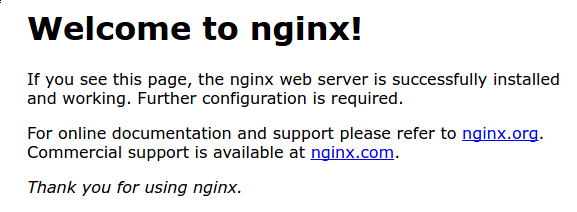

<h4 align="center">
  
</h4>

## CONTENTS:
  1.  [Введение](#введение)
  2.  [Шаг 1](#установка_nginx) — **Установка Nginx**
  3. Шаг 2 — **Настройка брандмауэра**
  4. Шаг 3 — **Проверка веб-сервера**
  5. Шаг 4 — **Управление процессом Nginx**
  6. Шаг 5 — **Настройка блоков сервера (рекомендуется)**
  7. Шаг 6 — **Знакомство с важными файлами и директориями Nginx**
  8. **Контент**
  9. **Конфигурация сервера**
  10. **Заключение**  

### Введение

[Nginx](https://nginx.org/ru/ "nginx.org") — один из самых популярных в мире веб-серверов, на базе которого размещены некоторые из самых крупных сайтов интернета с огромным трафиком. Это облегченный вариант, который можно использовать как веб-сервер или как обратный прокси.

В этом руководстве мы расскажем, как установить Nginx на вашем сервере Ubuntu 20.04, настроить брандмауэр, управлять процессом Nginx и создать блоки сервера для хостинга более одного домена с одного сервера.

---

### установка_nginx

Поскольку Nginx доступен в репозиториях Ubuntu по умолчанию, его можно установить из этих репозиториев с помощью системы пакетов apt.

Так как это первое наше взаимодействие с системой пакетов apt в этом сеансе, мы также обновим индекс локальных пакетов, чтобы получить доступ к актуальным спискам пакетов. Затем мы можем выполнить установку nginx:
